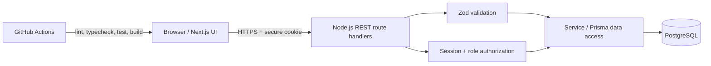
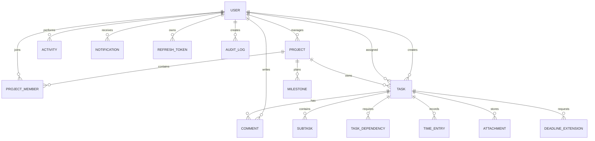
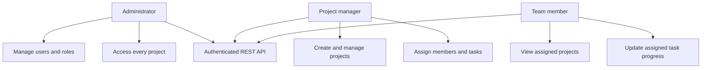

# System architecture

## Entity relationship diagram

## Use cases

The application is a modular monolith: the browser and server ship together, while all data access crosses authenticated REST endpoints or protected React Server Components. This offers simple deployment for the assignment and leaves clear seams for extracting services later.
